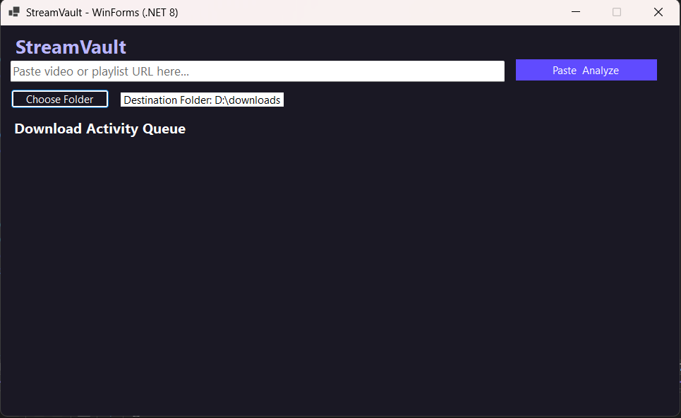
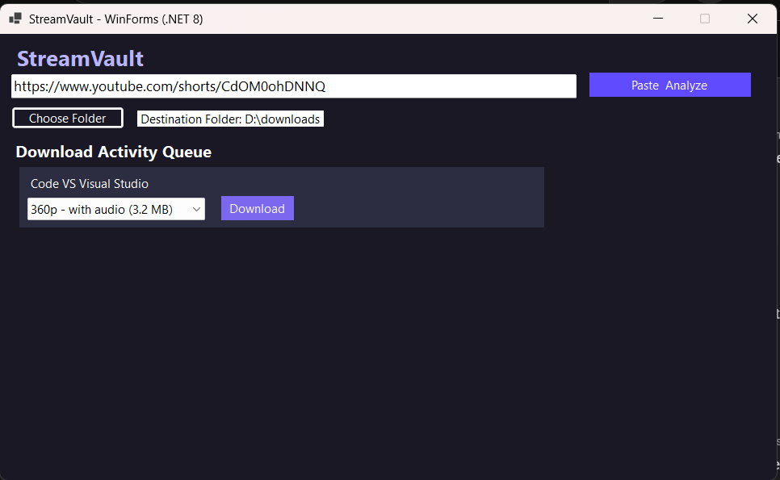
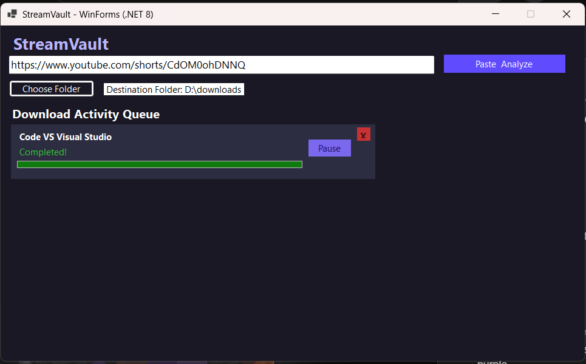

# StreamVault - YouTube Video Downloader (WinForms .NET 8)

**StreamVault** is a desktop application for downloading YouTube videos easily, with the ability to choose video quality and manage downloads directly from the interface.

---

## 🚀 Features

- Download videos from YouTube in multiple qualities (240p → 1080p).  
- Support for multiple simultaneous downloads.  
- Pause and resume downloads easily.  
- Cancel individual downloads.  
- Choose your preferred download folder.  
- Modern and user-friendly interface.

---

## 🖼️ Screenshots

**Main Interface:**  

  

**Quality Selection:**  

  

**Download Progress with Pause/Resume and Cancel Buttons:**  

  

> Note: Replace the image paths with actual screenshots in your repository.

---

## 📦 Installation

1. Run **StreamVaultInstaller.exe**.  
2. Follow the installation steps: Next → Next → Finish.  
3. Once completed, open the application from the Start Menu or Desktop shortcut.

---

## 📌 How to Use

1. Paste the YouTube video or playlist URL in the URL textbox.  
2. Click **Paste & Analyze** to fetch video information.  
3. Select the desired quality from the dropdown.  
4. Click **Download** to start downloading.  
5. Monitor download progress in the queue panel, and use **Pause/Resume** or **Cancel** as needed.

---

## 🛠️ Technical Notes

- Built using **C#** and **WinForms (.NET 8)**.  
- Uses the **YoutubeExplode** library to fetch and download videos.  
- Supports pausing and resuming downloads without losing progress.  
- Default download folder can be easily changed from the interface.

---

## 📜 License

StreamVault is open-source for personal, non-commercial use.  
All rights reserved © 2025 Ibrahim Mohamed.
